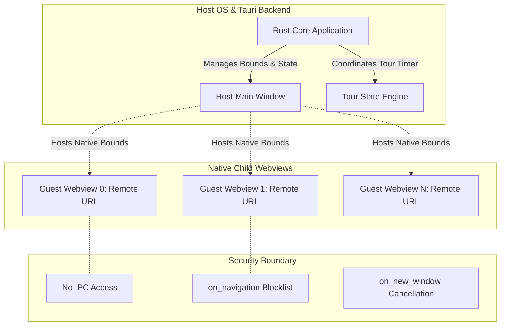

# Architecture Specification: Ambient Kiosk

## 1. System Overview

Ambient Kiosk is a dedicated multi-surface web dashboard designed for idle displays, wall monitors, and ambient workspaces. It organizes $N$ configured web endpoints into an auto-tiled layout (e.g., $3 \times 2$ for 6 endpoints), automatically runs a sequential tour that elevates each tile to full-screen view with a smooth transition, holds the view for a configured duration (e.g., 30 seconds), minimizes it back to its grid slot, and advances to the next tile.

```
+-------------------------------------------------------------+
|                        Window Frame                         |
|  +--------------------+ +--------------------+ +---------+  |
|  | Slot 0 (Webview 0) | | Slot 1 (Webview 1) | | Slot 2  |  |
|  +--------------------+ +--------------------+ +---------+  |
|  +--------------------+ +--------------------+ +---------+  |
|  | Slot 3 (Webview 3) | | Slot 4 (Webview 4) | | Slot 5  |  |
|  +--------------------+ +--------------------+ +---------+  |
|                                                             |
|           === Tour Trigger: Focus Slot 1 ===                |
|                                                             |
|  +-------------------------------------------------------+  |
|  |                                                       |  |
|  |              Slot 1 (Elevated / Maximized)            |  |
|  |                   Hold for 30s                        |  |
|  |                                                       |  |
|  +-------------------------------------------------------+  |
+-------------------------------------------------------------+
```

---

## 2. The Framing Problem & Desktop Architecture Comparison

### 2.1 The Failure of Pure Web `<iframe>` Architectures
Public websites enforce strict framing defenses:
1. **`X-Frame-Options: DENY` or `SAMEORIGIN`**: Directly rejects rendering inside any third-party `<iframe>`.
2. **`Content-Security-Policy: frame-ancestors 'self'`**: Modern replacement for X-Frame-Options, strictly disallowing foreign embedding.

Attempting to build an arbitrary multi-site viewer using pure browser `<iframe>` elements results in broken tiles across news outlets, financial dashboards, social platforms, and authenticated services.

### 2.2 Framework Paradigms: Electron vs. Tauri

| Dimension | Electron Architecture | Tauri v2 Architecture |
| :--- | :--- | :--- |
| **Guest View Primitive** | `WebContentsView` (formerly `BrowserView`) attached to `BaseWindow`. | Child `Webview` (`WebviewBuilder`) attached to parent `Window`. |
| **Deprecated/Anti-patterns** | `<webview>` tag is explicitly discouraged due to security and performance issues. Stripping CSP/XFO via headers is brittle. | Single webview running iframes cannot bypass system webview framing restrictions. |
| **Framing Bypass Mechanism** | `WebContentsView` is a top-level guest browsing context (not an iframe); XFO/frame-ancestors do not apply. | Child `Webview` is an independent native top-level OS webview (WKWebView on macOS, WebView2 on Windows); XFO/frame-ancestors do not apply. |
| **Engine Footprint** | Bundled Chromium binary (~150MB+ base size, high idle RAM per process). | OS-native WebViews (~10-15MB binary, shared OS web runtimes). |
| **Header Interception** | `session.webRequest.onHeadersReceived` exists, but stripping CSP drops site protections and breaks sub-resources. | No native header-stripping hook; relies strictly on top-level guest view isolation. |
| **Resizing / Animation** | GPU-composited in Chromium, but resizing guest contents still forces web reflow. | Native window messaging loops (`NSView` / `HWND`); requires coordinate interpolation. |

### Decision
Ambient Kiosk adopts **Tauri v2** using native child `Webview` instances anchored inside a master coordinator `Window`. This delivers minimal binary size, low memory consumption on idle displays, and native top-level guest isolation without proxying or stripping HTTP security headers.

---

## 3. Security Isolation Model

Arbitrary third-party web content loaded into a desktop container represents untrusted remote code execution. Ambient Kiosk enforces a strict boundary between the trusted controller runtime and untrusted guest webviews.



### 3.1 IPC Access Lockdown (Zero-Capability Policy)
* In Tauri v2, remote URLs are denied access to the IPC layer by default.
* The capability configuration (`src-tauri/capabilities/default.json`) must strictly assign permissions to the internal controller window (`main`), never matching remote patterns in `remote.urls`.
* Guest webviews cannot invoke any Rust commands, read files, or query system APIs.

### 3.2 Navigation Lockdown (`on_navigation`)
* Untrusted web pages may attempt top-level redirects or protocol manipulation (`file://`, `tauri://`, `custom://`).
* Each child `WebviewBuilder` registers an `on_navigation` callback:
  * Verifies the target URL scheme is strictly `http` or `https`.
  * Optionally restricts navigation to the configured origin, preventing page redirects from drifting away from the specified dashboard site.
  * Rejects non-HTTP schemes and unauthorized hops by returning `false`.

### 3.3 Popups and Breakout Prevention (`on_new_window`)
* Web pages attempting `window.open()` or clicking links with `target="_blank"` must not create unmanaged native windows or escape the kiosk frame.
* The `on_new_window` handler intercepts all new window requests:
  * Default behavior: cancels creation.
  * Configurable behavior: reuses the current webview slot or opens the link in the user's external default system browser via the OS shell if user-initiated.

### 3.4 Hardware and Device Permissions
* All guest webviews default to denying sensitive browser permissions (microphone, camera, geolocation, notification popups, MIDI, USB).
* Autoplay policies: sound muted by default to prevent ambient noise pollution across multiple idle feeds.

---

## 4. Layout & Motion Mechanics

### 4.1 Auto-Tiling Grid Geometry
Given $N$ endpoints and parent window dimensions $(W, H)$:
1. **Column Calculation**:
   $$C = \lceil\sqrt{N}\rceil$$
2. **Row Calculation**:
   $$R = \lceil N / C\rceil$$
3. **Slot Sizing**:
   $$w_{\text{slot}} = \frac{W - (C - 1) \cdot g - 2p}{C}, \quad h_{\text{slot}} = \frac{H - (R - 1) \cdot g - 2p}{R}$$
   where $g$ is grid gap and $p$ is window edge padding.
4. **Resting Coordinates for Slot $i$**:
   $$\text{col} = i \pmod C, \quad \text{row} = \lfloor i / C \rfloor$$
   $$x_i = p + \text{col} \cdot (w_{\text{slot}} + g), \quad y_i = p + \text{row} \cdot (h_{\text{slot}} + g)$$

### 4.2 The Native Animation Bottleneck & Solution
* **Problem**: Continuously resizing native child views (`NSView` on macOS or `CoreWebView2` on Windows) at 60 FPS triggers synchronous OS view invalidations and forces inner layout reflows in the guest web page on every frame, causing visual stutter and high CPU load.
* **Solution: Coordinate Interpolation & Elevation**:
  1. **Resting Phase**: All $N$ child webviews sit at their calculated $(x_i, y_i, w_i, h_i)$ resting bounds.
  2. **Transition Phase**:
     * The active webview is brought to the top of the z-order (elevation).
     * Instead of a continuous 60fps native window resize loop across all tiles, an animation timer runs an eased interpolation ($T \approx 400\text{--}600\,\text{ms}$) calculating intermediate logical bounds:
       $$x(t) = \text{lerp}(x_{\text{rest}}, x_{\text{max}}, e(t))$$
       $$y(t) = \text{lerp}(y_{\text{rest}}, y_{\text{max}}, e(t))$$
       $$w(t) = \text{lerp}(w_{\text{rest}}, w_{\text{max}}, e(t))$$
       $$h(t) = \text{lerp}(h_{\text{rest}}, h_{\text{max}}, e(t))$$
       using cubic ease-in-out: $e(t) = 3t^2 - 2t^3$.
     * Bounds are updated at a clamped animation cadence (~30-60 updates/sec depending on OS compositor efficiency) directly on the focused webview.
  3. **Maximized Phase**: Focused webview covers $(0, 0, W, H)$. Inactive webviews are hidden or remain static behind the focused view.
  4. **Restoration Phase**: The process is reversed to return the webview to its resting slot before moving to $i+1$.

---

## 5. Tour Engine & State Machine

```
              +-----------------------------+
              |           Stopped           |
              +-----------------------------+
                             | start_tour()
                             v
              +-----------------------------+
              |          GridRest           | <--------------------+
              +-----------------------------+                      |
                             |                                     |
              advance_timer  | select index i                      |
                             v                                     |
              +-----------------------------+                      |
              |      Maximizing(index)      |                      |
              +-----------------------------+                      |
                             | anim_complete                       |
                             v                                     |
     user     +-----------------------------+                      |
   interact   |      Maximized(index)       |                      |
  +---------> |      (Hold for 30s)         |                      |
  |           +-----------------------------+                      |
  | resume_tour              | hold_complete                       |
  |                          v                                     |
  +---------- +-----------------------------+                      |
   (paused)   |      Minimizing(index)      |                      |
              +-----------------------------+                      |
                             | anim_complete                       |
                             +-------------------------------------+
                                       index = (i + 1) % N
```

### 5.1 State Definitions
* **`Stopped`**: No active tour. Webviews remain in fixed grid layout.
* **`GridRest`**: Brief pause showing the entire grid before the next expansion begins.
* **`Maximizing(i)`**: Animating bounds of webview $i$ from resting to full viewport.
* **`Maximized(i)`**: Webview $i$ fully expanded. Hold timer active (e.g., 30 seconds).
* **`Minimizing(i)`**: Animating bounds of webview $i$ from full viewport back to resting.
* **`Paused`**: Tour timer paused due to explicit user interaction (click, scroll, mouse movement inside the maximized view) or user manual pause. Resumes after idle timeout.

---

## 6. Configuration Schema

Configuration is persisted locally (e.g., in `$APP_CONFIG_DIR/config.json`) and exposed via a lightweight settings drawer.

```json
{
  "version": 1,
  "settings": {
    "hold_duration_ms": 30000,
    "transition_duration_ms": 500,
    "grid_rest_duration_ms": 2000,
    "auto_start_tour": true,
    "pause_on_hover": false,
    "pause_on_interaction": true,
    "user_idle_resume_ms": 15000,
    "mute_audio": true,
    "refresh_interval_minutes": 15
  },
  "endpoints": [
    { "id": "1", "title": "Hacker News", "url": "https://news.ycombinator.com" },
    { "id": "2", "title": "GitHub Trending", "url": "https://github.com/trending" },
    { "id": "3", "title": "Weather Radar", "url": "https://radar.weather.gov" },
    { "id": "4", "title": "Financial Markets", "url": "https://tradingview.com" },
    { "id": "5", "title": "Server Status", "url": "https://status.cloud.google.com" },
    { "id": "6", "title": "BBC News", "url": "https://www.bbc.com/news" }
  ]
}
```

---

## 7. Performance & Resource Management

1. **Audio Isolation**: Automatically mute all guest webviews by default; allow unmute only via explicit user action on the focused tile.
2. **Process Throttling**: OS webview runtimes automatically throttle timers on occluded or background surfaces. In maximizing state, background webviews are occluded by the active top-level view, minimizing CPU usage.
3. **Periodic Reloading**: Configurable per-feed refresh intervals (e.g. reload every 15 minutes) prevent long-running single-page apps from accumulating memory leaks on continuous 24/7 idle screens.
