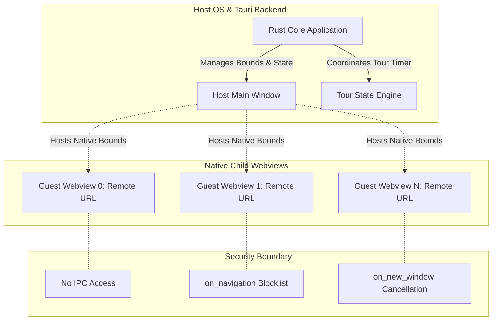

# Architecture Specification: Ambient Kiosk

## 1. System Overview

Ambient Kiosk is a dedicated multi-surface web dashboard designed for idle displays, wall monitors, and ambient workspaces. It organizes $N$ configured web endpoints into an auto-tiled layout that fills 100% of the window canvas with zero wasted margins.

### Operational Cadence (Alternating Overview & Focus)
The application continuously alternates between two complementary viewing modes:
1. **Multi-Website Grid View (Overview)**: All configured websites are simultaneously displayed side-by-side in full-bleed layout for a configurable duration (e.g., `grid_view_duration_ms: 20000`). This gives the user a live, ambient pulse of all feeds at a glance.
2. **Single-Website Maximized View (Deep Read)**: A single website smoothly expands from its grid slot to fill the entire window, holding for a dedicated reading period (e.g., `maximized_hold_duration_ms: 30000`).
3. **Pipelined Transition**: The active site minimizes back into its resting slot, returning to the multi-website grid view, while the upcoming site is pre-refreshed in the background. The cycle repeats sequentially across all endpoints.

### Default Presets (News & Market Feeds)
1. **Biztoc**: `https://biztoc.com/` (Business & financial headline stream)
2. **Alltoc**: `https://alltoc.com/` (Comprehensive news aggregator)
3. **Biztoc Wire**: `https://biztoc.com/wire` (Real-time financial wire)
4. **AP News Latest**: `https://apnews.com/hub/latest-news` (Breaking global news)
5. **Finviz News**: `https://finviz.com/news` (Market news & visual analytics)
```
+-------------------------------------------------------------------+
|                           Window Frame                            |
|  +---------------------+ +---------------------+ +-------------+  |
|  | Slot 0: Biztoc      | | Slot 1: Alltoc      | | Slot 2:     |  |
|  |                     | |                     | | Biztoc Wire |  |
|  +---------------------+ +---------------------+ +-------------+  |
|  +--------------------------------+ +---------------------------+  |
|  | Slot 3: AP News Latest         | | Slot 4: Finviz News       |  |
|  +--------------------------------+ +---------------------------+  |
|                                                                   |
|            === Tour Trigger: Focus Slot 1 (Alltoc) ===            |
|                                                                   |
|  +-------------------------------------------------------------+  |
|  |                                                             |  |
|  |                    Slot 1 (Maximized View)                  |  |
|  |                   Hold for 30s (Audio Muted)                |  |
|  |                                                             |  |
|  +-------------------------------------------------------------+  |
+-------------------------------------------------------------------+
```

---

## 2. The Framing Problem & Desktop Architecture Comparison

### 2.1 The Failure of Pure Web `<iframe>` Architectures
Public websites enforce strict framing defenses:
1. **`X-Frame-Options: DENY` or `SAMEORIGIN`**: Directly rejects rendering inside any third-party `<iframe>`.
2. **`Content-Security-Policy: frame-ancestors 'self'`**: Modern replacement for X-Frame-Options, strictly disallowing foreign embedding.

Attempting to build an arbitrary multi-site viewer using pure browser `<iframe>` elements results in broken tiles across news outlets, financial dashboards, social platforms, and authenticated services.

### 2.2 Framework Paradigms: Electron vs. Tauri

| Dimension | Electron Architecture | Tauri v2 Architecture |
| :--- | :--- | :--- |
| **Guest View Primitive** | `WebContentsView` (formerly `BrowserView`) attached to `BaseWindow`. | Child `Webview` (`WebviewBuilder`) attached to parent `Window`. |
| **Deprecated/Anti-patterns** | `<webview>` tag is explicitly discouraged due to security and performance issues. Stripping CSP/XFO via headers is brittle. | Single webview running iframes cannot bypass system webview framing restrictions. |
| **Framing Bypass Mechanism** | `WebContentsView` is a top-level guest browsing context (not an iframe); XFO/frame-ancestors do not apply. | Child `Webview` is an independent native top-level OS webview (WKWebView on macOS, WebView2 on Windows); XFO/frame-ancestors do not apply. |
| **Engine Footprint** | Bundled Chromium binary (~150MB+ base size, high idle RAM per process). | OS-native WebViews (~10-15MB binary, shared OS web runtimes). |
| **Header Interception** | `session.webRequest.onHeadersReceived` exists, but stripping CSP drops site protections and breaks sub-resources. | No native header-stripping hook; relies strictly on top-level guest view isolation. |
| **Resizing / Animation** | GPU-composited in Chromium, but resizing guest contents still forces web reflow. | Native window messaging loops (`NSView` / `HWND`); requires coordinate interpolation. |

### Decision
Ambient Kiosk adopts **Tauri v2** using native child `Webview` instances anchored inside a master coordinator `Window`. This delivers minimal binary size, low memory consumption on idle displays, and native top-level guest isolation without proxying or stripping HTTP security headers.

---

## 3. Security Isolation Model

Arbitrary third-party web content loaded into a desktop container represents untrusted remote code execution. Ambient Kiosk enforces a strict boundary between the trusted controller runtime and untrusted guest webviews.



### 3.1 IPC Access Lockdown (Zero-Capability Policy)
* In Tauri v2, remote URLs are denied access to the IPC layer by default.
* The capability configuration (`src-tauri/capabilities/default.json`) must strictly assign permissions to the internal controller window (`main`), never matching remote patterns in `remote.urls`.
* Guest webviews cannot invoke any Rust commands, read files, or query system APIs.

### 3.2 Navigation Lockdown (`on_navigation`)
* Untrusted web pages may attempt top-level redirects or protocol manipulation (`file://`, `tauri://`, `custom://`).
* Each child `WebviewBuilder` registers an `on_navigation` callback:
  * Verifies the target URL scheme is strictly `http` or `https`.
  * Optionally restricts navigation to the configured origin, preventing page redirects from drifting away from the specified dashboard site.
  * Rejects non-HTTP schemes and unauthorized hops by returning `false`.

### 3.3 Popups and Breakout Prevention (`on_new_window`)
* Web pages attempting `window.open()` or clicking links with `target="_blank"` must not create unmanaged native windows or escape the kiosk frame.
* The `on_new_window` handler intercepts all new window requests:
  * Default behavior: cancels creation.
  * Configurable behavior: reuses the current webview slot or opens the link in the user's external default system browser via the OS shell if user-initiated.

### 3.4 Hardware and Device Permissions
* All guest webviews default to denying sensitive browser permissions (microphone, camera, geolocation, notification popups, MIDI, USB).
* Autoplay policies: sound muted by default to prevent ambient noise pollution across multiple idle feeds.

---

## 4. Layout & Motion Mechanics

### 4.1 Scroll-Free Dynamic $M \times N$ Auto-Fitting Geometry
The layout engine guarantees that all $N$ configured endpoints fit simultaneously inside the single coordinator window without outer window scrollbars or clipping, using 100% of the display canvas:
* **Dynamic Scaling by Endpoint Count ($N$)**:
  * Small endpoint counts scale down subdivisions for large readability per site:
    * $N = 1 \implies 1 \times 1$ (single full-window tile)
    * $N = 2 \implies 2 \times 1$ (side-by-side split)
    * $N = 3 \implies 3 \times 1$ (three horizontal columns)
    * $N = 4 \implies 2 \times 2$ (quadrant grid)
    * $N = 5 \implies [3, 2]$ (3 columns top, 2 columns bottom)
    * $N = 6 \implies 3 \times 2$ (six equal boxes)
  * Larger endpoint counts automatically scale up subdivisions to preserve non-scrolling single-window visibility:
    * $N = 7 \implies [4, 3]$ (4 columns top, 3 columns bottom)
    * $N = 8 \implies 4 \times 2$
    * $N = 9 \implies 3 \times 3$
    * $N = 10 \implies [4, 3, 3]$ or $5 \times 2$
    * $N = 12 \implies 4 \times 3$

* **Deterministic Aspect-Ratio Scorer Algorithm**:
  To ensure tiles maintain readable landscape proportions on any display (16:9, 16:10, ultrawide) without outer scrollbars, the engine evaluates candidate row counts $r \in [1, N]$:
  1. For each candidate $r$, compute base columns $q = \lfloor N / r \rfloor$ and remainder $m = N \pmod r$.
  2. Define per-row column counts $c_i$ for each row $i \in [0, r - 1]$:
     $$c_i = \begin{cases} q + 1 & \text{if } i < m \\ q & \text{otherwise} \end{cases}$$
     guaranteeing $\sum_{i=0}^{r-1} c_i = m(q + 1) + (r - m)q = N$.
  3. Compute individual tile aspect ratios $\alpha_i = \frac{W \cdot r}{H \cdot c_i}$ for each row $i$.
  4. Score candidate $r$ against target reading aspect ratio ($\alpha_{\text{target}} \approx 1.4$) with symmetry weighting:
     $$\text{score}(r) = \frac{1}{r} \sum_{i=0}^{r-1} \left|\ln\left(\frac{\alpha_i}{\alpha_{\text{target}}}\right)\right| + 0.25 \cdot \mathbf{1}_{m > 0} + 0.1 \cdot \frac{m}{r}$$
  5. Optimal row count $R = \arg\min_{r \in [1, N]} \text{score}(r)$ with row partition $[c_0, \dots, c_{R-1}]$.
     * On 16:9 displays ($W/H = 1.777$), this deterministically yields:
       * $N = 1 \implies [1]$
       * $N = 2 \implies [2]$
       * $N = 3 \implies [3]$
       * $N = 4 \implies [2, 2]$
       * $N = 5 \implies [3, 2]$
       * $N = 6 \implies [3, 3]$ ($3 \times 2$)
       * $N = 7 \implies [4, 3]$
       * $N = 8 \implies [4, 4]$ ($4 \times 2$)
       * $N = 9 \implies [3, 3, 3]$ ($3 \times 3$)
       * $N = 10 \implies [4, 3, 3]$
       * $N = 12 \implies [4, 4, 4]$ ($4 \times 3$)
  6. Compute slot bounds for slot at row $r \in [0, R - 1]$ and column $k \in [0, c_r - 1]$:
     $$h_r = \frac{H - \text{header\_height} - (R - 1)g - 2p}{R}, \quad w_{r, k} = \frac{W - (c_r - 1)g - 2p}{c_r}$$
     $$x_{r, k} = p + k \cdot (w_{r, k} + g), \quad y_{r, k} = \text{header\_height} + p + r \cdot (h_r + g)$$
  7. In full-bleed mode ($p = 0, g = 0, \text{header\_height} = 0$), each tile expands to exact fractional bounds:
     $$w_{r, k} = \frac{W}{c_r}, \quad h_r = \frac{H}{R}, \quad x_{r, k} = k \cdot \frac{W}{c_r}, \quad y_{r, k} = r \cdot \frac{H}{R}$$
     $$\sum_{r=0}^{R-1} c_r \cdot \left(\frac{W}{c_r} \cdot \frac{H}{R}\right) = W \cdot H \quad (100\% \text{ client area, zero scrollbars})$$
### 4.2 Native Child Webview Realities & Portable Fallbacks
* **Z-Ordering Limitations**: Tauri v2's cross-platform `Webview` API provides `set_position`, `set_size`, `set_focus`, `hide`, `show`, and `close`, but lacks a portable `set_z_order` or `bring_to_front` method across OS backends.
* **Maximization Fallback (Sibling Hide Strategy)**:
  1. When webview $i$ initiates expansion, its bounds are interpolated toward $(0, 0, W, H)$.
  2. To avoid visual collision and occluded redraw stutter, inactive sibling webviews $(j \ne i)$ are hidden via `webview.hide()` during the transition or upon full maximization.
  3. When webview $i$ finishes minimizing back to $(x_i, y_i, w_i, h_i)$, sibling webviews are restored via `webview.show()`.
* **HUD & Controller Occlusion**:
  * Because native OS child webviews (`NSView`/`CoreWebView2`) render above the coordinator window's HTML DOM canvas, an in-DOM HUD will be obscured if child views overlap it.
  * **Architecture Solutions**:
    1. **Configurable Reserved Header Zone**: `reserved_header_height_px` defaults to `0` for 100% full-bleed screen utilization. If a persistent header bar is configured (e.g. `reserved_header_height_px: 40`), child webview resting bounds shift downward to $y \in [\text{header\_height}, H]$.
    2. **Frameless Overlay Window**: A dedicated secondary transparent window with `always_on_top(true)` for floating HUD controls without sacrificing main grid screen estate.
    3. **Global Shortcuts**: Tour controls driven via keyboard shortcuts (`Space` for pause, `Arrows` for navigation, `F11` for fullscreen).
* **Interaction Observation Limitations**:
  * Because guest webviews host cross-origin remote URLs under zero-capability isolation, the host DOM cannot inspect guest click or scroll events. Automatic interaction pause is an unproven Phase 0 hypothesis; global keyboard controls (`Space` to pause/resume) serve as the primary guaranteed control.
### 4.3 Just-In-Time Pre-Refresh (Pipelined Reloading)
To update headlines and charts before expansion:
1. **Trigger Moment**: When active tile $i$ finishes its hold duration and begins its `Minimizing` transition, the controller fires a native background reload command on tile $i+1$:
   ```rust
   // Rust controller triggers native background reload on upcoming target
   next_webview.reload().ok();
   ```
2. **Reload Lifecycle & Pending Flag**: Because Tauri's `PageLoadPayload` reports only target URL and `PageLoadEvent` without request or generation IDs, individual load events cannot be tagged at the API boundary. The coordinator enforces safe reloading by only triggering `reload()` on an idle view, marking that target webview as `pending_reload`, and accepting the first subsequent `PageLoadEvent::Finished`.
3. **Tour Generation Tokens & Timeout Handling**: An internal `tour_generation: u64` token is maintained by the tour controller solely to invalidate stale timeout callbacks and ignore delayed state transitions from previous cycles. If the safety timeout (e.g. 2500ms) elapses or load fails before `Finished` arrives, the engine clears the pending flag, leaves the incomplete view unmaximized in its resting slot, skips expansion for that cycle, and advances to prepare candidate $i + 2$. Handling cross-navigation redirects and race conditions is evaluated in the Phase 0 feasibility spike.

## 5. Tour Engine & State Machine

```
              +-----------------------------------------+
              |                 Stopped                 |
              +-----------------------------------------+
                                     | start_tour()
                                     v
              +-----------------------------------------+
              |        GridView (All Sites Live)        | <------------------------+
              |    (Overview hold: e.g. 20 seconds)     |                          |
              +-----------------------------------------+                          |
                                     |                                             |
                      advance_timer  | select target index i                       |
                                     v                                             |
              +-----------------------------------------+                          |
              |            Maximizing(index)            |                          |
              +-----------------------------------------+                          |
                                     | anim_complete                               |
                                     v                                             |
     user     +-----------------------------------------+                          |
   interact   |        MaximizedSingleSite(index)       |                          |
  +---------> |      (Deep Read: e.g. 30 seconds)       |                          |
  |           +-----------------------------------------+                          |
  | resume_tour                      | hold_complete                               |
  |                                  v                                             |
  +---------- +-----------------------------------------+                          |
   (paused)   |            Minimizing(index)            |                          |
              |        * next_webview.reload() *        |                          |
              +-----------------------------------------+                          |
                                     | anim_complete                               |
                                     v                                             |
              +-----------------------------------------+                          |
              |         PreparingNext(index + 1)        |                          |
              |       (Awaiting load_done | timeout)    |                          |
              +-----------------------------------------+                          |
                                     | load_done                                   |
                                     |-------------------------------------------->|
                                     | timeout (2.5s) / error                      |
                                     | (leave unmaximized in slot)                 |
                                     +-------------------------------------------->| (advance index)
                                                   index = (i + 1) % N
```

### 5.1 State Definitions
* **`Stopped`**: Tour halted. All webviews remain static in full-bleed grid layout.
* **`GridView`**: All configured webviews visible and active side-by-side in full-bleed layout. Held for `grid_view_duration_ms` (e.g. 20 seconds) so the user gets an overall ambient briefing.
* **`Maximizing(i)`**: Interpolating bounds of webview $i$ from resting grid slot to full window viewport $(0, 0, W, H)$.
* **`MaximizedSingleSite(i)`**: Webview $i$ fully expanded to 100% of window. Hold timer active for `maximized_hold_duration_ms` (e.g., 30 seconds).
* **`Minimizing(i)`**: Interpolating bounds of webview $i$ from full viewport back to its resting grid slot. Fires `next_webview.reload()` if target is idle.
* **`PreparingNext(target)`**: Transitional state between minimization and the next grid cycle. Awaits the first `on_page_load(Finished)` event for the pending target webview while guarding against stale timeouts via an internal `tour_generation` token.
  * **On load finish**: Clears pending reload flag and advances to `GridView`.
  * **On timeout (2.5s) or load error**: Leaves the incomplete webview unmaximized in its resting slot, clears pending reload flag, and advances to `GridView` with candidate incremented.
* **`Paused`**: Tour timer paused via keyboard shortcut (`Space`) or HUD control. Resumes upon unpause.
---

## 6. Comprehensive Configuration Schema & Portable Discovery

### 6.1 Configuration Precedence & Source-Aware Persistence
To maximize deployment flexibility while respecting OS security boundaries, code-signing integrity (macOS `.app` bundle sealing), and preventing silent preference shadowing, configuration resolution and persistence adhere to strict source-aware rules:

#### Precedence Order:
1. **Explicit CLI / Environment Override**:
   `--config <path>` command-line argument or `KIOSK_CONFIG=<path>` environment variable.
2. **Portable Bundle-Adjacent Config (Read-Only Override)**:
   * On macOS: `kiosk-config.json` situated adjacent to `AmbientKiosk.app` (resolved by traversing up from `Contents/MacOS` past `.app`). Never auto-written or modified.
   * On Windows/Linux: `kiosk-config.json` located adjacent to the executable binary.
   * When detected, this file acts as a read-only portable configuration override.
3. **User Application Support Directory (Writable Preferences)**:
   * macOS: `~/Library/Application Support/com.ambientkiosk.kiosk/config.json`
   * Windows: `%APPDATA%\com.ambientkiosk.kiosk\config.json`
   * Linux: `~/.config/com.ambientkiosk.kiosk/config.json`
4. **Compiled Defaults**:
   Built-in presets used if no external configuration file is detected.

#### Source-Aware Persistence & Shadowing Protection:
To eliminate silent shadowing (where saving changes to AppData would be ignored on the next launch due to an active higher-priority portable file):
* **When Portable / CLI Source is Active (`is_readonly: true`)**:
  * The settings UI displays a prominent "Configuration Managed / Read-Only" banner.
  * In-place saving is disabled. The UI provides an "Export / Save As..." function to write a separate config file to a user-chosen destination.
  * The Tauri backend command `save_config` rejects write attempts with an explicit error (`Err("Active configuration is locked by a higher-precedence source. Use Export to create an external configuration file.")`).
* **When AppData / Defaults Source is Active (`is_readonly: false`)**:
  * The settings UI operates in standard interactive mode.
  * In-place saves persist directly to the writable Application Support directory and take effect immediately.
### 6.2 Configuration Schema

```json
{
  "version": 1,
  "window": {
    "fullscreen": false,
    "decorations": false,
    "background_color": "#0d0d0d",
    "reserved_header_height_px": 0.0
  },
  "layout": {
    "strategy": "auto",
    "target_tile_aspect_ratio": 1.4,
    "rows": null,
    "padding_px": 0,
    "gap_px": 0
  },
  "timing": {
    "grid_view_duration_ms": 20000,
    "maximized_hold_duration_ms": 30000,
    "transition_duration_ms": 500,
    "preparing_timeout_ms": 2500,
    "user_idle_resume_ms": 15000
  },
  "tour": {
    "auto_start": true,
    "pause_on_interaction": true,
    "refresh_before_maximize": true,
    "loop_tour": true
  },
  "network_dns": {
    "adblock_dns_enabled": true,
    "dns_provider": "adguard_doh",
    "doh_url": "https://dns.adguard-dns.com/dns-query",
    "dot_url": "tls://dns.adguard-dns.com",
    "plain_dns_ip": "94.140.14.14:53"
  },
  "limits": {
    "max_resident_webviews": 12
  },
  "endpoints": [
    {
      "id": "1",
      "title": "Biztoc",
      "url": "https://biztoc.com/",
      "zoom_factor": 1.0,
      "muted": true,
      "reload_interval_minutes": 15
    },
    {
      "id": "2",
      "title": "Alltoc",
      "url": "https://alltoc.com/",
      "zoom_factor": 1.0,
      "muted": true,
      "reload_interval_minutes": 15
    },
    {
      "id": "3",
      "title": "Biztoc Wire",
      "url": "https://biztoc.com/wire",
      "zoom_factor": 1.0,
      "muted": true,
      "reload_interval_minutes": 15
    },
    {
      "id": "4",
      "title": "AP News Latest",
      "url": "https://apnews.com/hub/latest-news",
      "zoom_factor": 0.9,
      "muted": true,
      "reload_interval_minutes": 15
    },
    {
      "id": "5",
      "title": "Finviz News",
      "url": "https://finviz.com/news",
      "zoom_factor": 0.9,
      "muted": true,
      "reload_interval_minutes": 15
    }
  ]
}
```

---

## 7. Webview Concurrency & Resource Safety

1. **Full-Resident Grid ($M = N$)**: To satisfy the requirement that all configured websites appear simultaneously in a single window without scrolling, all $N$ configured endpoints are allocated resident native webviews in the grid.
2. **Safety Ceiling (`max_resident_webviews`)**: OS webview instances consume memory and GPU compositing contexts. The runtime enforces a configurable safety ceiling (`max_resident_webviews: 12`, configurable up to 16) validated at startup and config load. Configurations specifying $N > \text{max_resident_webviews}$ return an explicit validation error to prevent system thrashing or compositor crashes.
3. **In-Flight Reload Bounding**: At most one webview reload may be in flight at any given moment (the upcoming target tile).
4. **Concurrency & Event Loop Model**:
   * OS webview runtimes (WebKit / WebView2) manage their own internal helper processes and rendering threads; Tauri does not allocate an OS thread per site.
   * Native webview creation, destruction, and coordinate bounds mutations must execute on the OS main thread (mandated by AppKit on macOS and Win32 on Windows).
   * Tour timing, state machine transitions, readiness timeouts, and the local DNS-forwarding proxy run asynchronously on Tokio background tasks without blocking UI responsiveness.
---

## 8. Adblocking DNS Engine

News aggregators and financial portals (e.g. AP News, Biztoc, Finviz) serve aggressive banner networks, video ads, and analytics beacons that degrade kiosk legibility and waste bandwidth.

### 8.1 Integration Mechanism & Limitations
Operating system webviews (WebKit on macOS, WebView2 on Windows, WebKitGTK on Linux) do not expose a per-webview DNS configuration API; they automatically delegate all DNS lookups to the operating system network stack. A custom DNS endpoint (such as `https://dns.adguard-dns.com/dns-query`) cannot be configured natively on an individual webview context without affecting the host system.

To achieve app-scoped DNS adblocking without altering the user's system-wide network configuration, the architecture routes child webview traffic through a local loopback proxy:
1. **Local Forwarding Proxy**: The Rust backend spins up a lightweight embedded loopback proxy (supporting SOCKS5 CONNECT, HTTP CONNECT, and plain HTTP forwarding) on `127.0.0.1:<ephemeral_port>`.
2. **Upstream AdGuard DNS Resolution**:
   * The local proxy intercepts domain connections and resolves hostnames upstream using AdGuard DNS:
     * **Primary**: DNS-over-HTTPS (DoH) via `https://dns.adguard-dns.com/dns-query` (RFC 8484 wire format).
     * **Secondary / Fallback in Proxy**: Plain UDP DNS query to AdGuard resolver `94.140.14.14:53` if encrypted DNS fails or is unreachable. Zero system DNS fallback.
     * **Ad/Tracker Blocking**: Domains resolving to `0.0.0.0` are immediately blocked with HTTP 403 Forbidden / SOCKS5 REP 0x02.
3. **Tauri Webview Attachment**: Child `WebviewBuilder` instances are configured with `.proxy_url("http://127.0.0.1:<port>")`.

### 8.2 Defaults, User Opt-In, and Platform Fallback
* **Default Behavior**: AdGuard proxy-backed adblocking is active by default.
* **User Opt-In to System DNS**: The application configuration provides an explicit opt-in setting (`adblock_dns_enabled: false` / `dns_provider: "system"`). When selected, `proxy_url` is omitted, and webviews resolve hostnames directly via the host OS's standard system DNS without proxy overhead.

---

## 9. Cross-Platform Architectural Matrix (macOS vs. Windows vs. Linux)

| Architectural Dimension | macOS (Darwin) | Windows 10/11 | Linux (Desktop) |
| :--- | :--- | :--- | :--- |
| **Guest Webview Engine** | Native WKWebView (`WebKit.framework`) | Microsoft Edge WebView2 (`WebView2Loader.dll` / Chromium) | WebKitGTK 4.1 (`libwebkit2gtk-4.1.so`) |
| **Per-Webview Proxy Routing** | Native support (macOS 14+ with `macos-proxy` feature) | Native support in WebView2 | Native support in WebKitGTK |
| **Click-Through Windowing** | `set_ignore_cursor_events: true` via AppKit | `set_ignore_cursor_events: true` via Win32 | `set_ignore_cursor_events: true` via Gtk/X11 |
| **HUD Overlay Transparency** | Supported with `macOSPrivateApi: true` and `macos-private-api` Cargo feature | Supported natively by WebView2 | Requires active EWMH compositor (Mutter, KWin, Picom); black on non-composited WMs |
| **Global Shortcuts Subsystem** | Carbon event monitor via `global-hotkey` | Win32 `RegisterHotKey` via `global-hotkey` | X11 supported via `x11rb`; Wayland requires on-screen HUD buttons or XDG portal |
| **Desktop Coordinates** | Top-left desktop physical pixels (`cursor_position` matching `outer_position`) | Per-Monitor V2 physical pixels matching `outer_position` | X11/XWayland root window physical pixels |
| **Console Window Behavior** | Native GUI bundle without console | Suppressed via `#![cfg_attr(..., windows_subsystem = "windows")]` | Native ELF GUI process |
