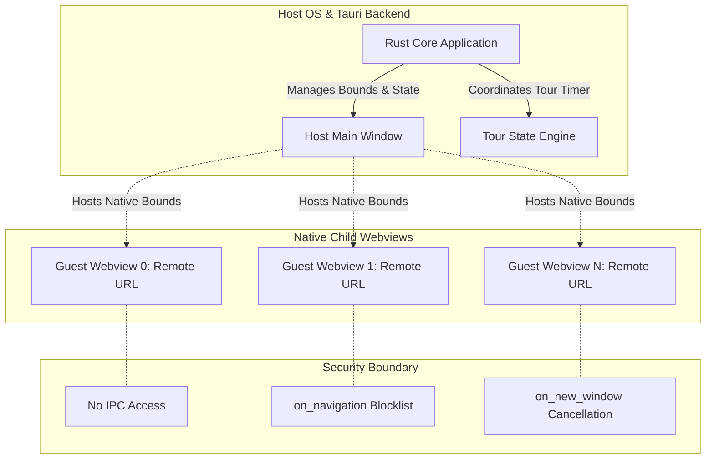

# Architecture Specification: Ambient Kiosk

## 1. System Overview

Ambient Kiosk is a dedicated multi-surface web dashboard designed for idle displays, wall monitors, and ambient workspaces. It organizes $N$ configured web endpoints into an auto-tiled layout (e.g., a $3 \times 2$ asymmetric grid for 5 presets: 3 top, 2 bottom), automatically runs a sequential tour that elevates each tile to full-screen view with a smooth transition, holds the view for a configured duration (e.g., 30 seconds), minimizes it back to its grid slot, and advances to the next tile.

### Default Presets (News & Market Feeds)
1. **Biztoc**: `https://biztoc.com/` (Business & financial headline stream)
2. **Alltoc**: `https://alltoc.com/` (Comprehensive news aggregator)
3. **Biztoc Wire**: `https://biztoc.com/wire` (Real-time financial wire)
4. **AP News Latest**: `https://apnews.com/hub/latest-news` (Breaking global news)
5. **Finviz News**: `https://finviz.com/news` (Market news & visual analytics)

```
+-------------------------------------------------------------------+
|                           Window Frame                            |
|  +---------------------+ +---------------------+ +-------------+  |
|  | Slot 0: Biztoc      | | Slot 1: Alltoc      | | Slot 2:     |  |
|  |                     | |                     | | Biztoc Wire |  |
|  +---------------------+ +---------------------+ +-------------+  |
|  +--------------------------------+ +---------------------------+  |
|  | Slot 3: AP News Latest         | | Slot 4: Finviz News       |  |
|  +--------------------------------+ +---------------------------+  |
|                                                                   |
|            === Tour Trigger: Focus Slot 1 (Alltoc) ===            |
|                                                                   |
|  +-------------------------------------------------------------+  |
|  |                                                             |  |
|  |                    Slot 1 (Maximized View)                  |  |
|  |                   Hold for 30s (Audio Muted)                |  |
|  |                                                             |  |
|  +-------------------------------------------------------------+  |
+-------------------------------------------------------------------+
```

---

## 2. The Framing Problem & Desktop Architecture Comparison

### 2.1 The Failure of Pure Web `<iframe>` Architectures
Public websites enforce strict framing defenses:
1. **`X-Frame-Options: DENY` or `SAMEORIGIN`**: Directly rejects rendering inside any third-party `<iframe>`.
2. **`Content-Security-Policy: frame-ancestors 'self'`**: Modern replacement for X-Frame-Options, strictly disallowing foreign embedding.

Attempting to build an arbitrary multi-site viewer using pure browser `<iframe>` elements results in broken tiles across news outlets, financial dashboards, social platforms, and authenticated services.

### 2.2 Framework Paradigms: Electron vs. Tauri

| Dimension | Electron Architecture | Tauri v2 Architecture |
| :--- | :--- | :--- |
| **Guest View Primitive** | `WebContentsView` (formerly `BrowserView`) attached to `BaseWindow`. | Child `Webview` (`WebviewBuilder`) attached to parent `Window`. |
| **Deprecated/Anti-patterns** | `<webview>` tag is explicitly discouraged due to security and performance issues. Stripping CSP/XFO via headers is brittle. | Single webview running iframes cannot bypass system webview framing restrictions. |
| **Framing Bypass Mechanism** | `WebContentsView` is a top-level guest browsing context (not an iframe); XFO/frame-ancestors do not apply. | Child `Webview` is an independent native top-level OS webview (WKWebView on macOS, WebView2 on Windows); XFO/frame-ancestors do not apply. |
| **Engine Footprint** | Bundled Chromium binary (~150MB+ base size, high idle RAM per process). | OS-native WebViews (~10-15MB binary, shared OS web runtimes). |
| **Header Interception** | `session.webRequest.onHeadersReceived` exists, but stripping CSP drops site protections and breaks sub-resources. | No native header-stripping hook; relies strictly on top-level guest view isolation. |
| **Resizing / Animation** | GPU-composited in Chromium, but resizing guest contents still forces web reflow. | Native window messaging loops (`NSView` / `HWND`); requires coordinate interpolation. |

### Decision
Ambient Kiosk adopts **Tauri v2** using native child `Webview` instances anchored inside a master coordinator `Window`. This delivers minimal binary size, low memory consumption on idle displays, and native top-level guest isolation without proxying or stripping HTTP security headers.

---

## 3. Security Isolation Model

Arbitrary third-party web content loaded into a desktop container represents untrusted remote code execution. Ambient Kiosk enforces a strict boundary between the trusted controller runtime and untrusted guest webviews.



### 3.1 IPC Access Lockdown (Zero-Capability Policy)
* In Tauri v2, remote URLs are denied access to the IPC layer by default.
* The capability configuration (`src-tauri/capabilities/default.json`) must strictly assign permissions to the internal controller window (`main`), never matching remote patterns in `remote.urls`.
* Guest webviews cannot invoke any Rust commands, read files, or query system APIs.

### 3.2 Navigation Lockdown (`on_navigation`)
* Untrusted web pages may attempt top-level redirects or protocol manipulation (`file://`, `tauri://`, `custom://`).
* Each child `WebviewBuilder` registers an `on_navigation` callback:
  * Verifies the target URL scheme is strictly `http` or `https`.
  * Optionally restricts navigation to the configured origin, preventing page redirects from drifting away from the specified dashboard site.
  * Rejects non-HTTP schemes and unauthorized hops by returning `false`.

### 3.3 Popups and Breakout Prevention (`on_new_window`)
* Web pages attempting `window.open()` or clicking links with `target="_blank"` must not create unmanaged native windows or escape the kiosk frame.
* The `on_new_window` handler intercepts all new window requests:
  * Default behavior: cancels creation.
  * Configurable behavior: reuses the current webview slot or opens the link in the user's external default system browser via the OS shell if user-initiated.

### 3.4 Hardware and Device Permissions
* All guest webviews default to denying sensitive browser permissions (microphone, camera, geolocation, notification popups, MIDI, USB).
* Autoplay policies: sound muted by default to prevent ambient noise pollution across multiple idle feeds.

---

## 4. Layout & Motion Mechanics

### 4.1 Auto-Tiling & Asymmetric Grid Geometry
For $N = 5$ (default preset) across window dimensions $(W, H)$ with padding $p$ and gap $g$:
* Row count $R = 2$, split as 3 tiles in row 0 and 2 tiles in row 1.
* Row height:
  $$h_{\text{slot}} = \frac{H - g - 2p}{2}$$
* Row 0 (3 columns, slots 0, 1, 2):
  $$w_{\text{row0}} = \frac{W - 2g - 2p}{3}, \quad x_i = p + i \cdot (w_{\text{row0}} + g), \quad y_i = p$$
* Row 1 (2 columns, slots 3, 4):
  $$w_{\text{row1}} = \frac{W - g - 2p}{2}, \quad x_i = p + (i - 3) \cdot (w_{\text{row1}} + g), \quad y_i = p + h_{\text{slot}} + g$$

For arbitrary $N$, row-by-row greedy distribution calculates:
$$C = \lceil\sqrt{N}\rceil, \quad R = \lceil N / C\rceil$$
where remainder slots in the final row can either stretch across available width or retain the standard column width.

### 4.2 Native Child Webview Realities & Portable Fallbacks
* **Z-Ordering Limitations**: Tauri v2's cross-platform `Webview` API provides `set_position`, `set_size`, `set_focus`, `hide`, `show`, and `close`, but lacks a portable `set_z_order` or `bring_to_front` method across OS backends.
* **Maximization Fallback (Sibling Hide Strategy)**:
  1. When webview $i$ initiates expansion, its bounds are interpolated toward $(0, 0, W, H)$.
  2. To avoid visual collision and occluded redraw stutter, inactive sibling webviews $(j \ne i)$ are hidden via `webview.hide()` during the transition or upon full maximization.
  3. When webview $i$ finishes minimizing back to $(x_i, y_i, w_i, h_i)$, sibling webviews are restored via `webview.show()`.
* **HUD & Controller Occlusion**:
  * Because native OS child webviews (`NSView`/`CoreWebView2`) render above the coordinator window's HTML DOM canvas, an in-DOM HUD will be obscured if child views overlap it.
  * **Architecture Solutions**:
    1. **Reserved Top Bar**: Window coordinator reserves a $40\,\text{px}$ header zone ($y \in [0, 40]$); child webviews are strictly bounded within $y \in [40, H]$.
    2. **Frameless Overlay Window**: A dedicated secondary transparent window with `always_on_top(true)` for floating HUD controls.
    3. **Global Shortcuts**: Tour controls driven via keyboard shortcuts (`Space` for pause, `Arrows` for navigation, `F11` for fullscreen).

### 4.3 Just-In-Time Pre-Refresh (Pipelined Reloading)
To ensure that headlines and live charts are fresh without exposing the user to mid-tour loading spinners:
1. **Trigger Moment**: When active tile $i$ finishes its hold duration and begins its `Minimizing` transition, the controller immediately fires a background reload command to tile $i+1$:
   ```rust
   // Rust controller triggers background refresh on upcoming target
   next_webview.eval("window.location.reload()").ok();
   ```
2. **Pipelined Window**: Tile $i+1$ performs network fetch, HTML parsing, and DOM layout reflow while tile $i$ minimizes ($500\,\text{ms}$) and while the grid pauses during `GridRest` ($1500\text{--}2000\,\text{ms}$).
3. **Result**: When tile $i+1$ starts expanding, its content is fully rendered and up to date, eliminating visible layout reflows during the zoom animation.

---

## 5. Tour Engine & State Machine

```
              +-----------------------------+
              |           Stopped           |
              +-----------------------------+
                             | start_tour()
                             v
              +-----------------------------+
              |          GridRest           | <------------------------+
              +-----------------------------+                          |
                             |                                         |
              advance_timer  | select index i                          |
                             v                                         |
              +-----------------------------+                          |
              |      Maximizing(index)      |                          |
              +-----------------------------+                          |
                             | anim_complete                           |
                             v                                         |
     user     +-----------------------------+                          |
   interact   |      Maximized(index)       |                          |
  +---------> |      (Hold for 30s)         |                          |
  |           +-----------------------------+                          |
  | resume_tour              | hold_complete                           |
  |                          v                                         |
  +---------- +-----------------------------+                          |
   (paused)   |      Minimizing(index)      |                          |
              |  * JIT RELOAD (index + 1) * |                          |
              +-----------------------------+                          |
                             | anim_complete                           |
                             +-----------------------------------------+
                                           index = (i + 1) % N
```

### 5.1 State Definitions
* **`Stopped`**: No active tour. Webviews remain in fixed grid layout.
* **`GridRest`**: Brief pause showing the entire grid before the next expansion begins.
* **`Maximizing(i)`**: Animating bounds of webview $i$ from resting to full viewport.
* **`Maximized(i)`**: Webview $i$ fully expanded. Hold timer active (e.g., 30 seconds).
* **`Minimizing(i)`**: Animating bounds of webview $i$ from full viewport back to resting.
* **`Paused`**: Tour timer paused due to explicit user interaction (click, scroll, mouse movement inside the maximized view) or user manual pause. Resumes after idle timeout.

---

## 6. Configuration Schema

Configuration is persisted locally (e.g., in `$APP_CONFIG_DIR/config.json`) and exposed via a lightweight settings drawer.

```json
{
  "version": 1,
  "settings": {
    "hold_duration_ms": 30000,
    "transition_duration_ms": 500,
    "grid_rest_duration_ms": 2000,
    "refresh_before_maximize": true,
    "auto_start_tour": true,
    "pause_on_interaction": true,
    "user_idle_resume_ms": 15000,
    "mute_audio": true,
    "active_pool_size": 5,
    "prefetch_buffer_size": 1,
    "adblock_dns_enabled": true,
    "dns_provider": "adguard_doh",
    "doh_url": "https://dns.adguard-dns.com/dns-query",
    "dot_url": "tls://dns.adguard-dns.com",
    "plain_dns_ip": "94.140.14.14:53"
  },
  "endpoints": [
    { "id": "1", "title": "Biztoc", "url": "https://biztoc.com/" },
    { "id": "2", "title": "Alltoc", "url": "https://alltoc.com/" },
    { "id": "3", "title": "Biztoc Wire", "url": "https://biztoc.com/wire" },
    { "id": "4", "title": "AP News Latest", "url": "https://apnews.com/hub/latest-news" },
    { "id": "5", "title": "Finviz News", "url": "https://finviz.com/news" }
  ]
}
```

---

## 7. Bounded Webview Pool & Lifecycle Management

To prevent unbounded thread creation, memory bloat, and GPU process crashes when users configure dozens of sites:
1. **Active Pool Cap**: The runtime maintains at most $M$ active webview instances matching the visible grid layout (e.g., $M = 5$ for the 3/2 preset) plus an optional $K = 1$ prefetch buffer for upcoming offscreen sites.
2. **Virtualization**: Additional endpoints beyond $M + K$ remain virtualized as URL records in memory.
3. **Thread Architecture**:
   * OS event loop and native webview message processing execute on the OS main thread (as required by AppKit and Win32).
   * Tour timing, coordinate calculations, and DNS proxy forwarding run on asynchronous Tokio background worker threads, preventing UI lockups.

---

## 8. Adblocking DNS Engine

News aggregators and financial portals (e.g. AP News, Biztoc, Finviz) serve aggressive banner networks, video ads, and analytics beacons that degrade kiosk legibility and waste bandwidth.

### 8.1 Integration Mechanism
Operating system webviews (WebKit on macOS, WebView2 on Windows) rely on OS-level DNS resolution and do not support traditional browser adblock extensions.

Ambient Kiosk applies network-level adblocking using **AdGuard DNS**:
1. **Local Forwarding Proxy**: The Rust backend spins up a lightweight embedded loopback proxy (HTTP / SOCKS5) on `127.0.0.1:<ephemeral_port>`.
2. **DNS Routing**:
   * **Primary: DNS-over-HTTPS (DoH)**: Queries resolved via `https://dns.adguard-dns.com/dns-query`.
   * **Secondary: DNS-over-TLS (DoT)**: Queries resolved via `tls://dns.adguard-dns.com`.
   * **Fallback: Plain DNS**: Direct UDP/TCP queries to AdGuard resolver `94.140.14.14:53`.
3. **Tauri Webview Attachment**: Each child `WebviewBuilder` is initialized with `.proxy_url("http://127.0.0.1:<port>")` pointing to the local proxy.
4. **User Opt-In / System DNS**: A configuration toggle `adblock_dns_enabled` permits switching back to standard system DNS resolution without proxy overhead.
